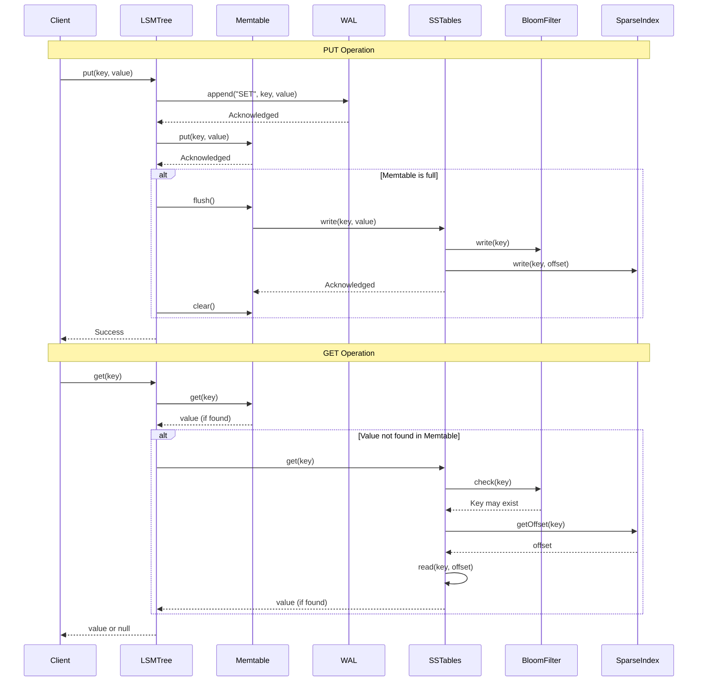
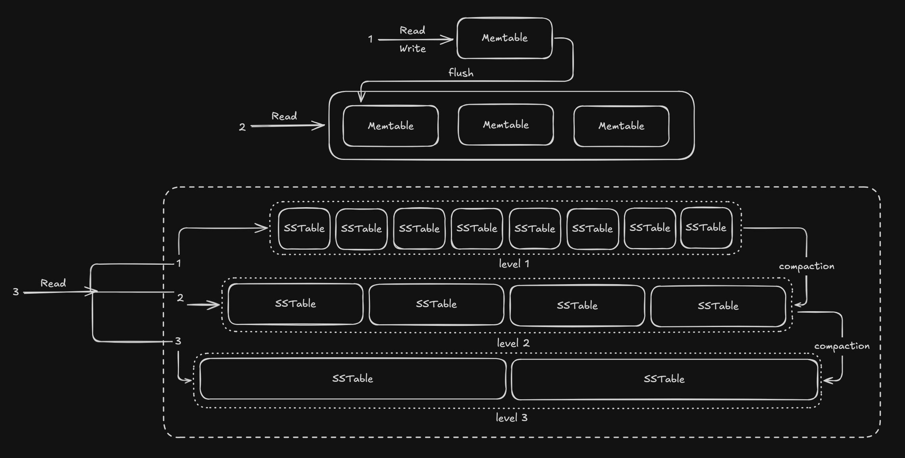

# GravelDB

## About:
GravelDB is a key value, LSM based, RESP compliant, WAL enabled database written in Java.

## Contents
- Overview
- Architecture
- Benchmark
- Run
- Further development
- References

## Overview:
This database includes:
- a LSM datastore
- a basic lexer
- a basic parser
- write ahead log
- RESP handler
- python based client

This project is an effort to understand what goes on to building production ready, from scrath data store. I was always fascinated by LSM data structure. It is not even a structure but a suite of structure working together.

## Architecture
### Memtable
Using java.util.ConcurrentSkipList based memtable. Insertion, update and deletion are `O(log(n))`. 
Also a LinkedList of memtables is also maintained as a buffer till it is flushed.

### SSTable
Sorted string table is a file in the disk which stores key value pair data in lexicographical sorted way. 
The data format is

### File structure
```
GravleDB/  
├── waldata/  
│   └── <unique_id>_wal.data  
└── dbdata/  
    └── sstable_1/  
        ├── 1_filter.data  
        ├── 1_index.data  
        └── 1_ssfile.data  
```

### Bloom filter
Bloom filter is used to eliminate the sstables which does not contain the key.  
Bloom filter is able to tell for sure if the value does not exist, but it produces false positives when value is not present.
To mitigate the false positive rate we use 7 hash functions and 1000 bit array. The hash is combination of murmur, siphash and salt.

### Sparse index
It stores the offset of key after every x count of keys.  
The data format in the file is ```<key length><key><offset><key length><key><offset>```.

### Memtable flush
After certain threshold memtable is moved to immutable memtable list. The ```flushMemtable()``` process fetches the oldest added memtable and starts the flushing process, which involves sstable, bloom filter and sparse index creation.  

After completion, the memtable is removed from the immutable list and the SSTable file gets added to the first tier of SSTable list. The bloom and sparse file are linked to SSTable file.  

Since the memtable is now flushed to disk the wal file associated with the memtable is removed.  

The ```flushMemtable``` function is invoked every 50ms.

### Compaction
The ```compaction()``` function is invoked every 50ms. The oldest SSTable is checked first for compaction. If any tier crosses the x byte threshold for that tier,  the tier gets compacted and then added to the next tier.  

The tier size is calculated by $TIER SIZE * TIER MULTIPLE^{LEVEL}$.  
Here ```TIER SIZE``` is smallest tier size, ```TIER MULTIPLE``` is the factor with which new tier size is increased, ```LEVEL``` is the count of tier starting with 0. For eg, if ```TIER SIZE``` is 2, ```TIER MULTIPLE``` is 4 and ```TIER COUNT``` is 4 then sizes are ```2*2^0=2, 2*2^1=4, 2*2^2=8, 2*2^3=32```.

### Sequence Diagram


### Read and Write path


## Benchmark
GET benchmark  
PUT benchmark  

## Run
to run ```./gradlew run```  
to test ```./gradlew test```  
to benchmark ```./gradlew jmh```  

## Further development
-[ ] Code documentation 
-[ ] Read and Write locking 
-[ ] bloom filter and sstable benchmark 
-[ ] Cloud Deployment for referential benchmark result
-[ ] Properties file for static and constant values
-[ ] Level tiered compaction
-[ ] Multiple parallel compaction and flushMemtable process
-[ ] Persist tier and SSTable metadata to restore the tree to its previous state after application restart
-[ ] Skip-List from scratch