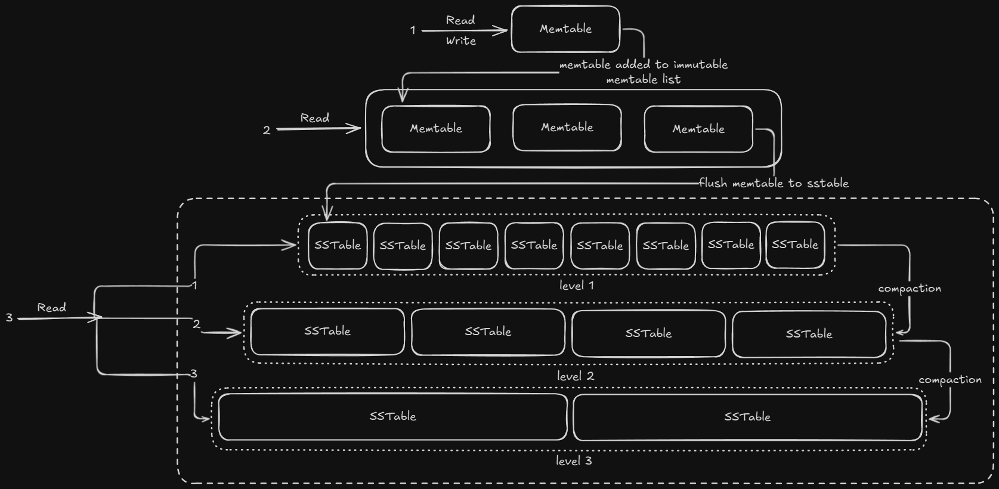

# GravelDB

## About:
GravelDB is a key value, LSM based, RESP compliant, WAL enabled database written in Java.

## Contents
- [Overview](#Overview)
- [Architecture](#Architecture)
- [Benchmark](#Benchmark)
- [Run](#Run)
- [Further development](#Further-development)
- [References](#References)

## Overview:
This database includes:
- Netty for non blocking db operations
- a LSM datastore
- a basic lexer
- a basic parser
- write ahead log
- RESP handler
- python based client

This project aims to explore the process of building a production-grade LSM data store from scratch.

## Architecture

### Memtable
The memtable is implemented using java.util.ConcurrentSkipListMap, providing O(log(n)) time complexity for insertions, updates, and deletions.

Additionally, a linked list of immutable memtables are maintained as a buffer until they are flushed.

### WAL
All new writes are first stored in the memtable and simultaneously written to an on-disk file known as the Write-Ahead Log (WAL).

The WAL file persists until the memtable is flushed. Once the memtable is flushed, the corresponding WAL file is deleted.

If the application restarts, the WAL file is used to restore the application's state.

The data format in WAL file is ```<GET/SET> key value```

### SSTable
A Sorted String Table (SSTable) is a file on disk that stores key-value pairs in lexicographically sorted order.

The data format in the file is ```<key length><value length><key><value>```.

### File structure
```  
GravleDB/  
├── waldata/  
│   └── <unique_id>_wal.data  
└── dbdata/  
    └── sstable_1/  
        ├── 1_filter.data  
        ├── 1_index.data  
        └── 1_ssfile.data  
```  
  
### Bloom filter  
A Bloom filter is used to eliminate SSTables during the get operation, that do not contain the key. It can definitively confirm that a key is absent but may produce false positives when the key is not present.  
  
To mitigate the false positive rate, we use seven hash functions and a 50000-bit array. The hashing mechanism is a combination of Murmur, Siphash, and salt value.  

Formula to calculate false positive is:  
%5Ek)

### Sparse index  
It stores the offset of key after every x count of keys. In the code a key and its offset is stored after every 500th key.  

The data format in the file is ```<key length><key><offset>```.  
  
### Memtable flush  
When the memtable reaches a certain threshold, it is moved to the immutable memtable list. The flushMemtable() process then selects the oldest memtable and begins flushing it, which includes creating the SSTable, Bloom filter, and sparse index.

Once the flush is complete, the memtable is removed from the immutable list, and the SSTable file is added to the first tier of the SSTable list. The Bloom filter and sparse index files are linked to the SSTable.

Since the memtable has been written to disk, its associated WAL file is deleted.

The flushMemtable() function runs every 50ms.  
  
### Compaction  
The compaction() function is triggered every 50ms, starting with the oldest SSTable. If a tier exceeds its designated size threshold, it undergoes compaction and is subsequently moved to the next tier.     

The size of each tier is determined by the formula:   
> $TIER SIZE * TIER MULTIPLE^{LEVEL}$.    

Where:
- ```TIER SIZE``` represents the base size of the smallest tier.
- ```TIER MULTIPLE``` is the growth factor for each successive tier.
- ```LEVEL``` denotes the tier index, starting from 0.  

For eg, if ```TIER SIZE``` is 2, ```TIER MULTIPLE``` is 4 and ```TIER COUNT``` is 4 then sizes are ```2*2^0=2, 2*2^1=4, 2*2^2=8, 2*2^3=32```.  
  
### Sequence Diagram  


### Read and Write path


## Benchmark
On 1M randomly generated keys.
```  
Benchmark                 Mode  Cnt      Score     Error  Units  
LSMTreeAddBenchmark.add  thrpt    5  11341.461 ┬▒ 395.259  ops/s  
LSMTreeGetBenchmark.get  thrpt    5   2050.456 ┬▒ 167.582  ops/s  
```  

## Run
to run ```./gradlew run```  
to test ```./gradlew test```  
to benchmark ```./gradlew jmh```  

A Python client, ```graveldb-client.py```, is included in the package. Alternatively, you can use ```redis-cli```, ensuring that GravelDB is running in place of the Redis server.

## Further development
- [ ] Read Write locks and fine-grained locking  
- [ ] Dynamically determine the optimal level size and Bloom filter configuration based on the workload  
- [ ] On cloud execution for consistent and correct benchmark result  
- [ ] More benchmarking metrics   
- [ ] Primitives data types    
- [ ] Properties file for static and constant values  
- [ ] Level tiered compaction  
- [ ] Multiple parallel compaction and flushMemtable process  
- [ ] Persist tier and SSTable metadata to restore the tree to its previous state after application restart  
- [ ] More datastores

## References
- Database internals, Chapter 7
- Designing data intensive applications, Chapter 3
- Very good LSM write up - https://skyzh.github.io/mini-lsm/
- quick dive on compaction - https://www.alibabacloud.com/blog/an-in-depth-discussion-on-the-lsm-compaction-mechanism_596780

> There is definitely room for significant improvement. I'm open to any optimizations or changes that can enhance performance and constantly looking at ways to optimize it even more. Feel free to reach out with any questions about the implementation, or fork the repository and submit a pull request to contribute further.
